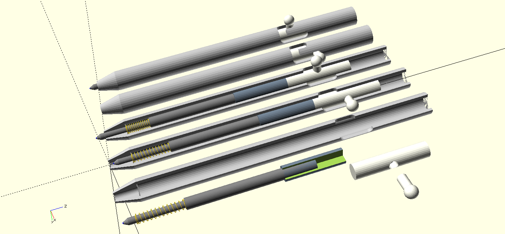
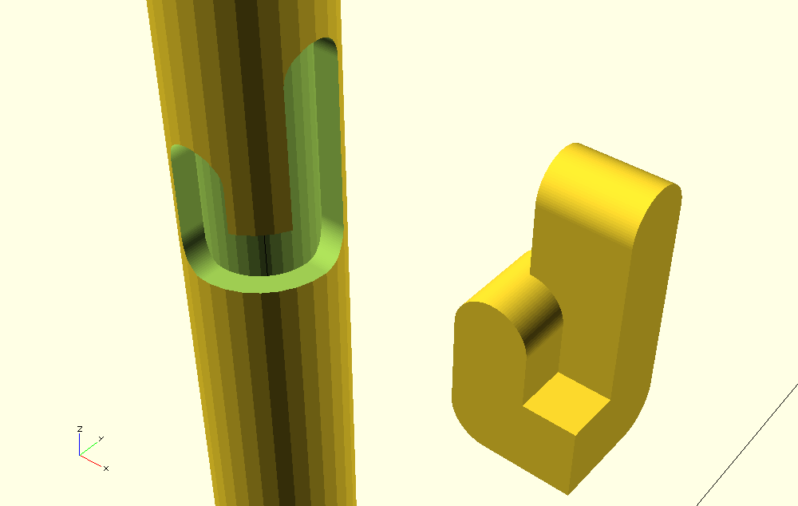
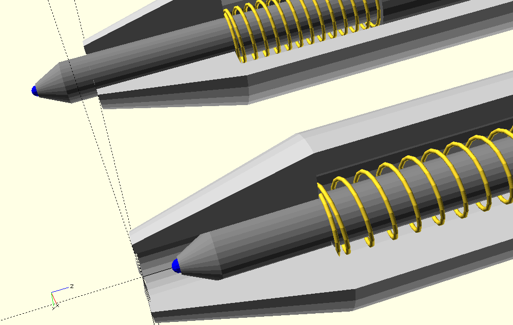
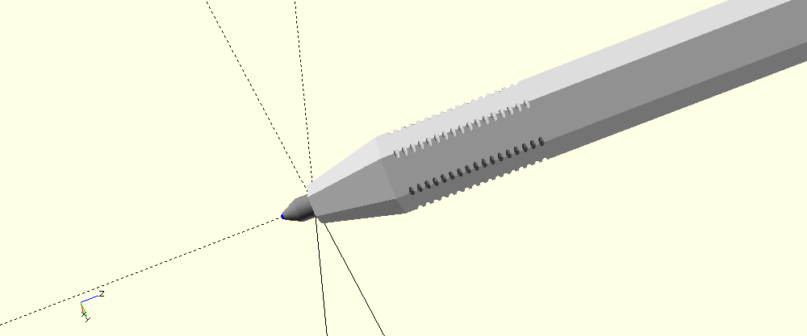
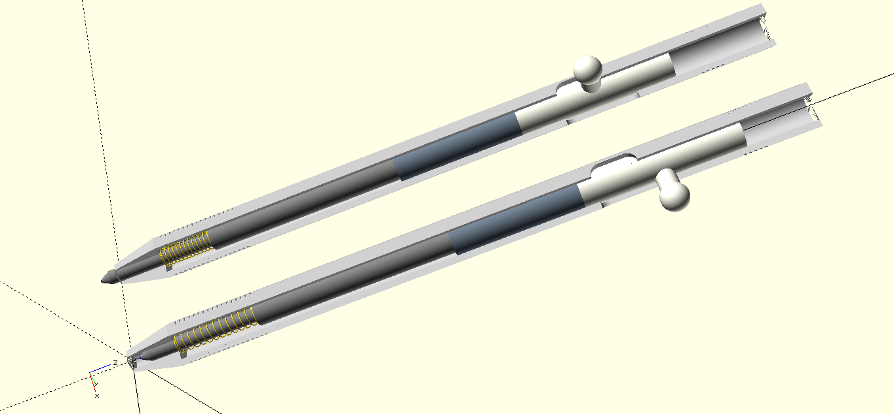

#LockerSpacePen



##Introducing the Pen
This is my first model created with OpenSCAD (and my first use of a CAD software btw)

This Pen is intended to stay minimalistic (the fewest possible amount of pieces) but having no cap (i loose them) and a nice mechanism.

##The tree
Each piece is built on a separate .scad file, thus working on the pen body shape will result in only messing with the body file (Pen.scad)

The lockerSpacePen.scad file helps having the whole view of the pen.

##The locktrace
The lever of the locker follows the trace below:

```
module lockerTrace()
{
	translate([0,0,1040]) {
		hull() {
					rotate([90,0,0]) cylinder(h = 50, r=20.5, center = false, $fn=100);
			translate([0,0,-50]) {
				rotate([90,0,0]) cylinder(h = 50, r=20.5, center = false, $fn=100);
			}
		}
		hull() {
			translate([0,0,-50]) {
				rotate([90,0,90]) cylinder(h = 50, r=20.5, center = false, $fn=100);
			}
			translate([0,0,60]) {
				rotate([90,0,90]) cylinder(h = 50, r=20.5, center = false, $fn=100);
			}
		}

		translate([0,-50,-70.5]) cube([50,50,41]);
	}
}

```

##The Spring
The spring code was taken and adapted from here: http://goo.gl/4sxTqA



##Jimping

NB: on the above pic, external cylinder render is limited to 6 to get an hexagonal pen.

As extruding is too CPU intensive, the code now use cynlinder difference instead:
```
module jimping()
{
	for (i = [120:10:280]) {
		//rotate_extrude() translate([50,i,0]) circle (3, $fn=7);
		translate([0,0,i]) difference() {
			cylinder(h=3, d=110, $fn=10);
			cylinder(h=3, d=95, $fn=100);
		}
	}
	for (i = [1250:10:1290]) {
		//rotate_extrude() translate([50,i,0]) circle (3, $fn=7);
		translate([0,0,i]) difference() {
			cylinder(h=3, d=110, $fn=10);
			cylinder(h=3, d=95, $fn=100);
		}
	}
}
```
##[Hexa]gon Pen

Pen body can be either "rounded": with external cylinder with a resolution like $fn=100 or more
```
module bodyStylo()
{
	translate([0,0,100]) {
		difference(){
			cylinder(h = 1300, r = 50, $fn=100);
			cylinder(h = 1300, r = 35, $fn=100);
		}
	}
	translate([0,0,0]) {
		difference(){
			cylinder(h = 100, r1 = 25, r2 = 50, $fn=100);
			cylinder(h = 100, r = 18, $fn=100);
		}
	}
}
```

Or Hexagonal with $fn=6:
```
module bodyStylo()
{
	translate([0,0,100]) {
		difference(){
			cylinder(h = 1300, r = 50, $fn=6);
			cylinder(h = 1300, r = 35, $fn=100);
		}
	}
	translate([0,0,0]) {
		difference(){
			cylinder(h = 100, r1 = 25, r2 = 50, $fn=6);
			cylinder(h = 100, r = 18, $fn=100);
		}
	}
}

Or any other polygonal shape :) by variating the $fn value.
```

##3D Printing
unit steps are of 0.1mm, thus if you try printing as is you'll get a 130cm pen if the printer reads the units as mm, either edit all values manually or use the following code to resize it to 130mm:
```
resize([13,0,0], true) {
stylo();
}
``` 

